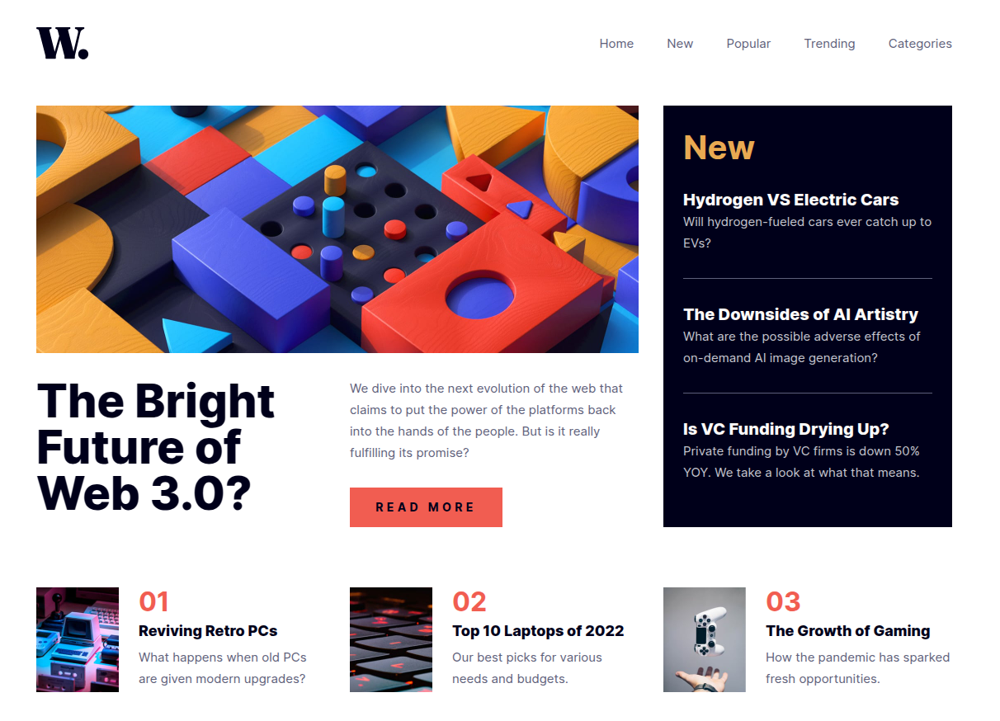
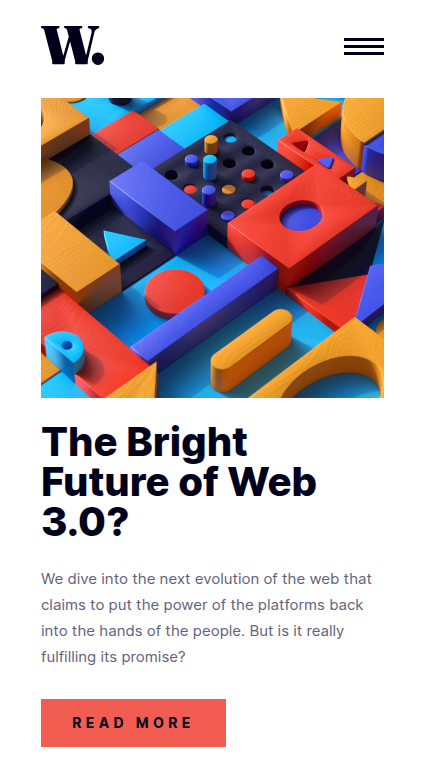

# Frontend Mentor - News homepage solution

This is a solution to the [News homepage challenge on Frontend Mentor](https://www.frontendmentor.io/challenges/news-homepage-H6SWTa1MFl). Frontend Mentor challenges help you improve your coding skills by building realistic projects. 

## Table of contents

- [Frontend Mentor - News homepage solution](#frontend-mentor---news-homepage-solution)
  - [Table of contents](#table-of-contents)
  - [Overview](#overview)
    - [The challenge](#the-challenge)
    - [Screenshot](#screenshot)
    - [Links](#links)
  - [My process](#my-process)
    - [Built with](#built-with)
    - [В роботі використовував:](#в-роботі-використовував)
    - [Чого навчився:](#чого-навчився)
  - [Acknowledgments](#acknowledgments)
 

**Note: Delete this note and update the table of contents based on what sections you keep.**

## Overview

### The challenge

Що можна навчитись:

- Налаштувати вигляд макету залежно від розміру екрану девайса корисувача
- Налаштувати `hover` для елементів та анімацію для меню 

### Screenshot





### Links

- Посилання на Live Site URL: [GitHub Pages](https://slavon213.github.io/fr24-news-homepage/)


## My process

### Built with

- Semantic HTML5 markup
- CSS custom properties
- CSS Grid

### В роботі використовував:


- для обмеження контенту по ширині  `div` з класом `container`;
- семантичні теги `header`, `main`
- `grid` для розміщення елементів по сітці 
- `subgrid` для розміщення і вирівнювання  елементів всередині батьківської сітки
- `input checkbox` і `label` для зміни відображення меню


Для нормального відображення на екрані мобільного пристрою використав бургер-меню. Реалізував його так:


```html
<input type="checkbox" id="menuCheckbox" />
<label class="burger" for="menuCheckbox">
  <span></span>
  <span></span>
  <span></span>
</label>
```
А стилі такі:

```css
.burger {
        --burger-line-width: 100%;
        --burger-line-height: 3px;
        --burger-line-gap: 4px;

        width: 40px;
        height: 100%;
        position: absolute;
        right: 0;
        top: 50%;
        transform: translateY(-50%);
        display: none;
        gap: var(--burger-line-gap);
        align-content: center;
        z-index: 4;
        cursor: pointer;
    }
    span {
        display: inline-block;
        width: var(--burger-line-width);
        height: var(--burger-line-height);
        background-color: var(--dark-space-blue);
        transition: transform 0.5s ease, opacity 0.5s ease;
    }
```
Оскільки в проекті не застосовував `JavaScript`, то для перемикання вигляду меню використав стан `checked` від `input type="checkbox"`:

> :bulb: Тут тільки шматок коду, реалізацію можна подивитись в `style.css`.
```css
 #menuCheckbox:checked ~ ul {
        transition: transform 0.15s ease;
        transform: translateX(0%);
    }
```

### Чого навчився:

- не покладатися повністю на чужий `reset.css` — часом додає клопоту в пошуках дрібних деталей 
- одним `CSS` без  `JavaScript` складно контролювати поведінку елементів, які розміщені на вищому рівні вкладеності
- використовувати `input checkbox` для зміни  властивостей інших елементів
- навчився робити просту анімацію для бургер-меню


## Acknowledgments

Дякую наставнику Івану за підказки і також колегам-студентам.


